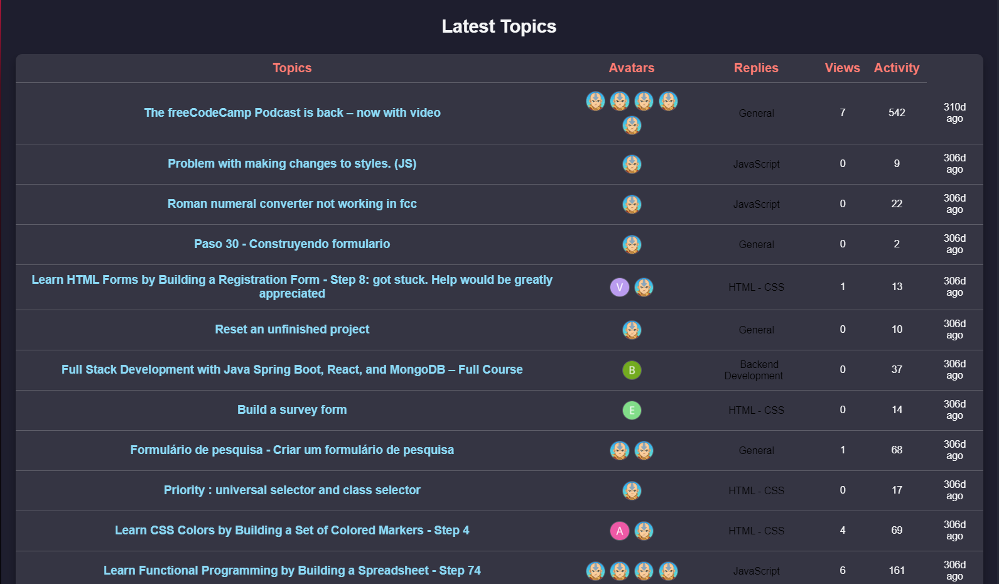

# 🚀 fCC Forum Leaderboard


Welcome to the **fCC Forum Leaderboard**! This project fetches and displays the latest discussions from the freeCodeCamp forum in a clean, responsive, and dynamic table format. It's a showcase of my front-end development skills, using modern JavaScript, API handling, and responsive design.

## 📌 Features

- **Live Data Fetching:** Fetches the latest topics from the freeCodeCamp forum API.
- **Dynamic UI Updates:** Renders posts, avatars, categories, views, replies, and activity timestamps in real time.
- **Category Highlighting:** Posts are color-coded based on their category.
- **Responsive Design:** Looks great on all screen sizes with smooth scrolling.
- **Clean & Modern UI:** Styled with CSS and structured for readability and maintainability.

## 🛠️ Technologies Used

- **HTML5** – Structuring the page.
- **CSS3** – Styling with a focus on responsiveness.
- **JavaScript (ES6+)** – Fetching and rendering data dynamically.
- **freeCodeCamp Forum API** – Data source for topics and user information.

## 📂 Project Structure

```
📦 fcc-forum-leaderboard
├── 📜 index.html       # Main HTML file
├── 🎨 styles.css       # Styling for the leaderboard
├── 📜 script.js        # JavaScript for fetching and displaying data
├── 📜 README.md        # You are here!
```


1. Clone the repository:
   ```sh
   git clone https://github.com/yourusername/fcc-forum-leaderboard.git
   ```
2. Navigate to the project folder:
   ```sh
   cd fcc-forum-leaderboard
   ```
3. Open `index.html` in your browser and watch the leaderboard come to life!
## 🎯 What I Learned

- **Working with APIs** – Fetching and handling JSON data from an external API.
- **DOM Manipulation** – Dynamically updating the UI with JavaScript.
- **Responsive Design** – Ensuring the leaderboard adapts to different screen sizes.
- **Error Handling** – Managing fetch requests and potential issues gracefully.

## 🚀 Future Improvements

- **Sorting & Filtering:** Allow users to sort by replies, views, or activity.
- **Dark Mode:** Add a toggle for a dark mode theme.
- **More Interactivity:** Improve UX with animations and transitions.

## 👋 About Me

Hey there! I'm **Mduduzi Ndlovu**, an aspiring **Junior Front-End Developer** with a passion for building sleek, user-friendly interfaces. I love working with JavaScript, CSS, and modern web technologies. This project is part of my journey to becoming a skilled developer, and I'm always looking to learn and improve!

💡 **Looking for opportunities!** If you're a recruiter or developer, let's connect. I'm eager to bring my skills to a team that values clean code and great user experiences.

---

🔥 _"Code is like humor. When you have to explain it, it’s bad." – Cory House_

Thanks for stopping by! ⭐ If you liked this project, feel free to fork, star, or suggest improvements!

